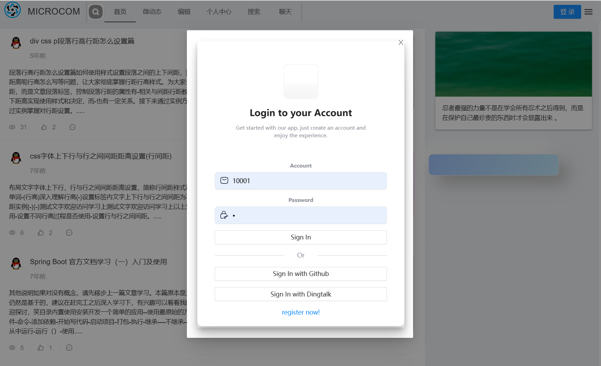
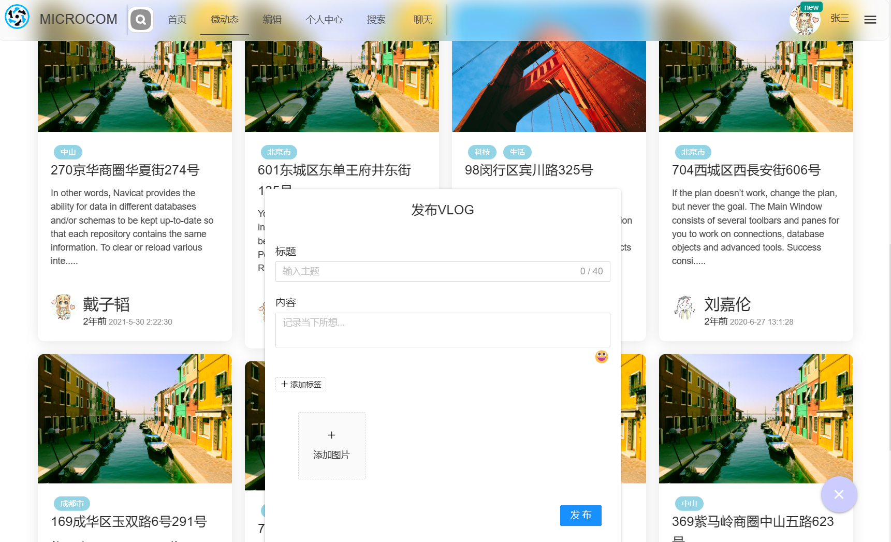
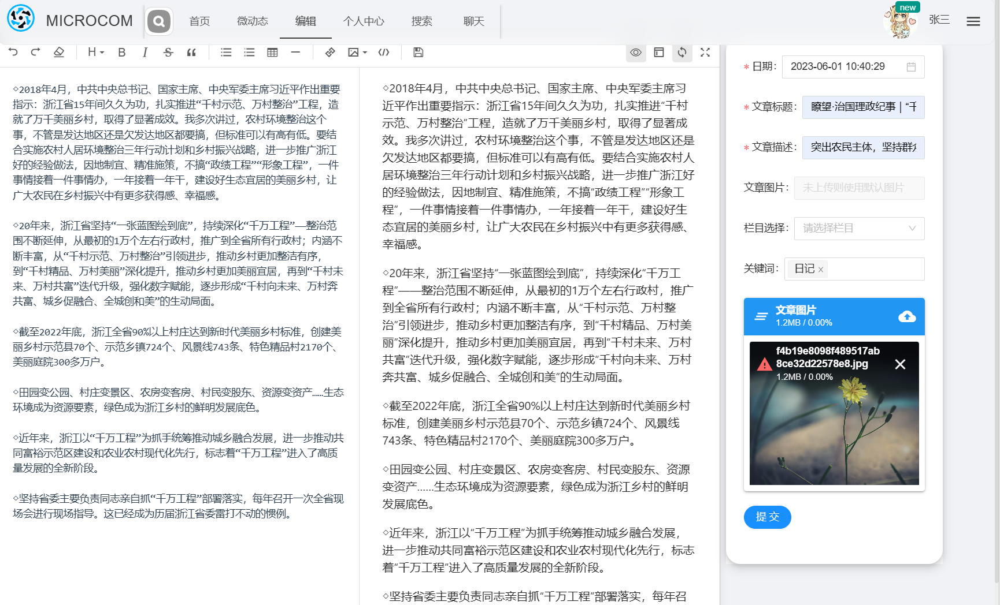
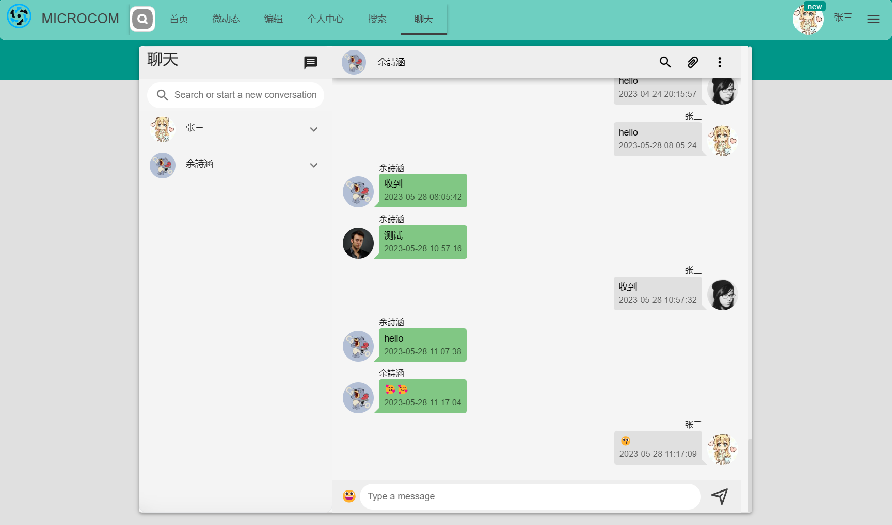

# MICROCOM

### 微社区网站

### 1、基本介绍

一个微社区网站，用户可以发布动态以及博客。使用Mahout协同过滤推荐算法对用户进行动态推荐。后续将会不断完善，添加新的功能。

**Todo List:**

- [x] 使用Spingboot构建
- [x] 使用SpringMVC
- [x] 使用Mybatis-plus
- [x] 引入第三方登录框架 JustAuth
- [x] 引入权限认证框架Sa-Token
- [x] nacos服务注册与发现
- [x] 将后端各个模块微服务化
- [x] 容器化
- [ ] 使用消息队列实现信息离线发送
- [ ] 后端管理界面
- [ ] 前端使用Nuxt构建

### 2、项目结构

```txt
microcom
├─ framework  #核心框架包括定时，授权，过滤，数据获取
│  ├─ pom.xml
│  └─ src
│     └─ main
│       ├─ java
│       │  └─ com
│       │     └─ mu
│       │        ├─ auth  #OAuth授权
│       │        ├─ config  #配置文件
│       │        ├─ constant  #常量对象
│       │        ├─ controller
│       │        ├─ cron  #定时任务
│       │        ├─ current  #异常处理
│       │        ├─ entity  
│       │        ├─ filter
│       │        ├─ mapper
│       │        ├─ McirocomApplication.java
│       │        ├─ SensitiveWord #铭感词过滤
│       │        ├─ service  
│       │        └─ utils
│       └─ resources
│          ├─ application.yml
│          ├─ bootstrap.yml
│          ├─ com
│          │  └─ mu
│          │     └─ mapper
│          ├─ config  #定时任务，邮箱工具配置
│          ├─ Dockerfile
│          └─ static
├─ gateway  #服务网关，服务访问入口
│  ├─ pom.xml
│  └─ src
│     └─ main
│        ├─ java
│        │  └─ com
│        │     └─ mu
│        │        ├─ config
│        │        ├─ GatewayApplication.java
│        │        └─ service
│        └─ resources
└─ RecommenderSystem  #推荐系统
   ├─ logs
   ├─ pom.xml
   └─ src
      ├─ main
         ├─ java
         │  └─ com
         │     └─ mu
         │        ├─ controller
         │        ├─ entity
         │        ├─ exception
         │        ├─ extra  #额外的实现类
         │        ├─ mapper
         │        ├─ RecommenderSystemApplication.java
         │        ├─ service
         │        └─ utils
         └─ resources
```

### 3、使用技术

前后端分离，使用spring boot、mybatis-plus

前端使用Vue3 + Ant Design + Quasar,Vue-cli构建

数据库使用Mysql5.7，Redis

搜素引擎MeiliSearch，数据同步MeiliSync

Docker部署,Mahout算法

### 4、使用说明

#### 4.1 数据库

```txt
执行microcom/sql/microcom.sql创建数据库
修改各模块中application.yaml的配置，本项目中使用nacos作为配置中心
```

#### 4.2 部署

##### 4.2.1后端

**打包**

```sh
mvn package
```

**编写Dockerfile**

```dockerfile
# 基础镜像使用java Docker官方已经弃用java8镜像，想使用jdk1.8的话，可以使用openjdk
FROM openjdk:8
# 作者
LABEL maintainer="1437487442@qq.com"
# VOLUME 指定临时文件目录为/tmp，在主机/var/lib/docker目录下创建了一个临时文件并链接到容器的/tmp
VOLUME /tmp
# 将jar包添加到容器中并更名为framework.jar
ADD recommender-0.0.1-SNAPSHOT.jar recommender.jar
# 运行jar包
RUN bash -c 'touch /recommender.jar'
ENTRYPOINT ["java","-jar","/recommender.jar"]
#暴露8082端口作为微服务
EXPOSE 8082
```

```sh
docker build -t gateway:1.0 .
```

**docker-compose**

```yaml
version: 3

services:
  framework:
    image: framework:1.0
    container_name: framework
    port:
      - "8081:8080" 
    depends_on:
      - gateway
  
  gateway:
    image: gateway:1.0
    container_name: gateway
    port: 
      - "9999:9999"
  
  recommender:
    image: recommender:1.0
    container_name: recommender
    port: 
      - "8082:8082"
    depends_on:
      - gateway
```

```sh
docker-compose -f microcom-compose.yml up -d
```

##### 4.2.2 前端

**进入microcom-ui**

```sh
npm install
npm run serve
```

### 5、界面

#### 5.1 登录



#### 5.2 动态浏览


#### 5.3 发布动态



#### 5.4 发布博客



#### 5.5 聊天界面



#### 5.6 搜索


> 工具地址

[MeiliSearch： A lightning-fast search engine that fits effortlessly into your apps, websites, and workflow](https://github.com/meilisearch/meilisearch)

[MeiliSync: Realtime sync data from MySQL/PostgreSQL/MongoDB to meilisearch ](https://github.com/long2ice/meilisync)
